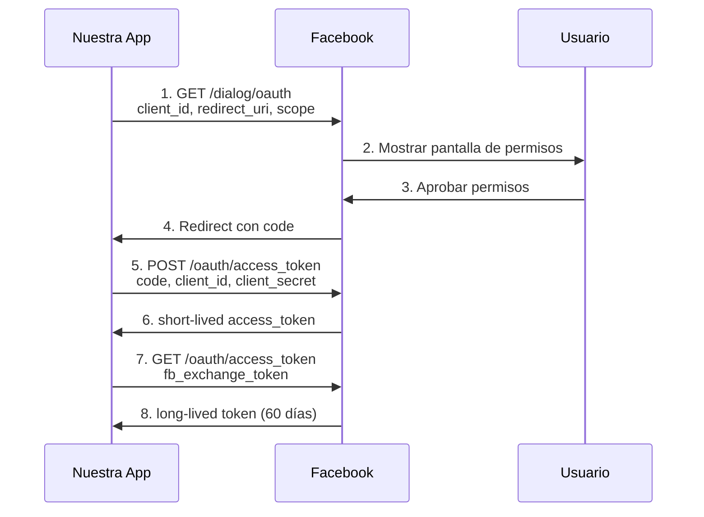
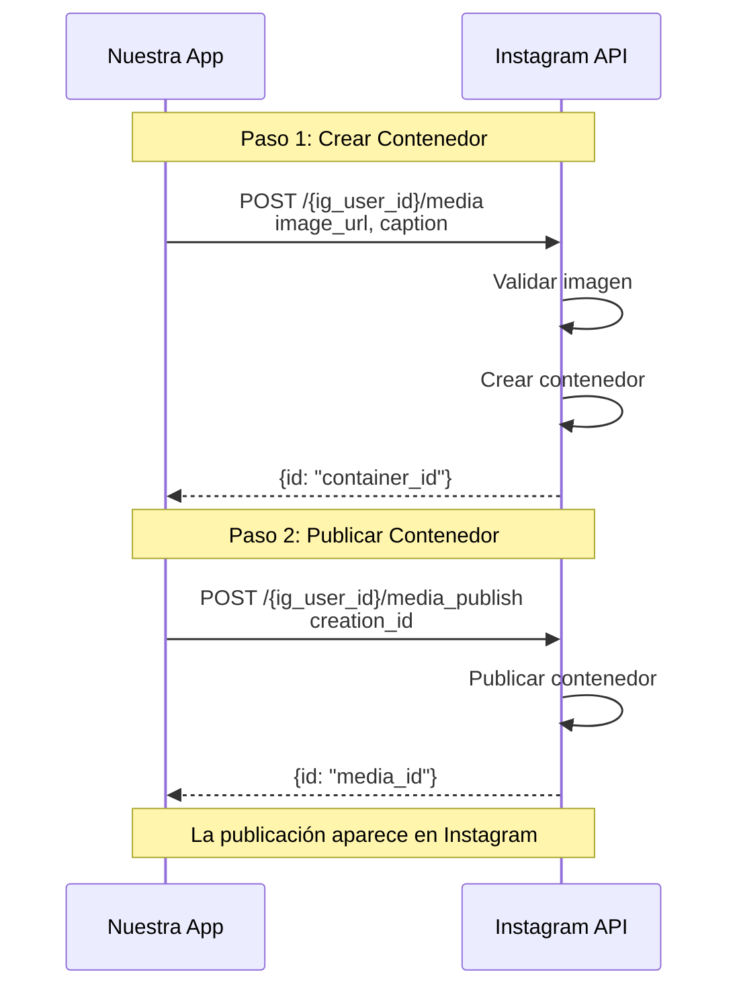
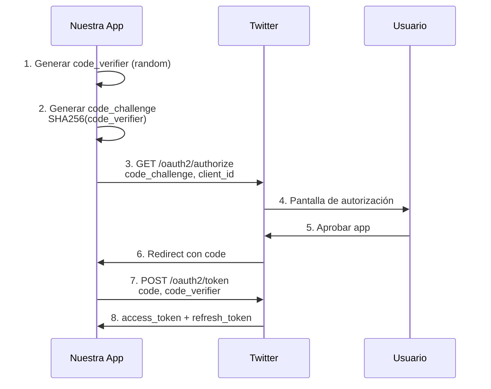
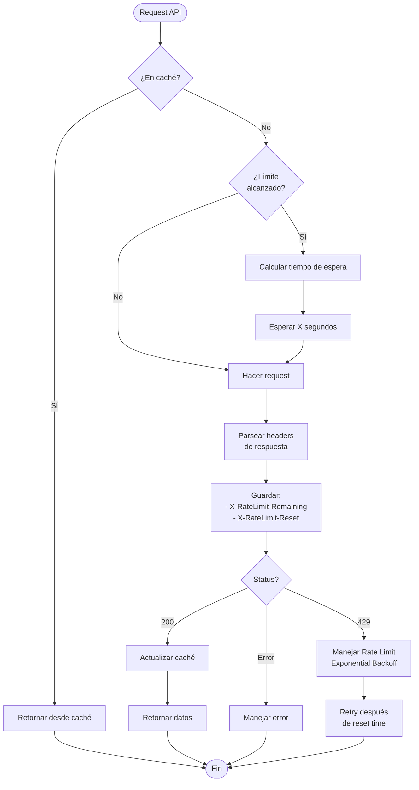
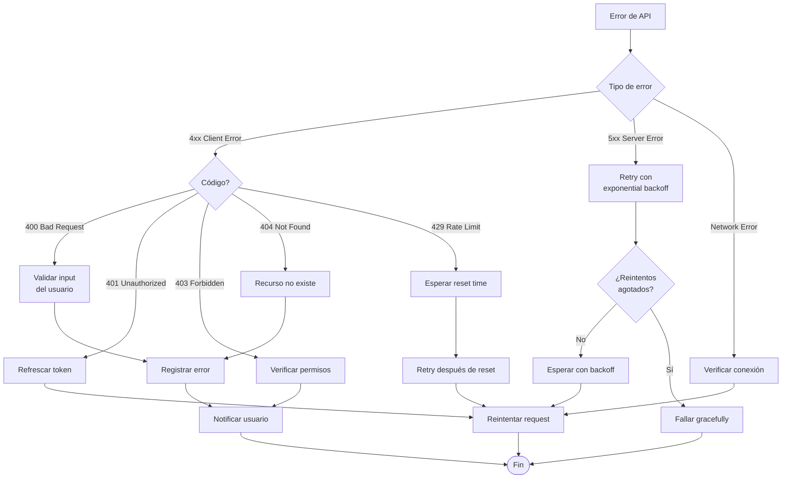
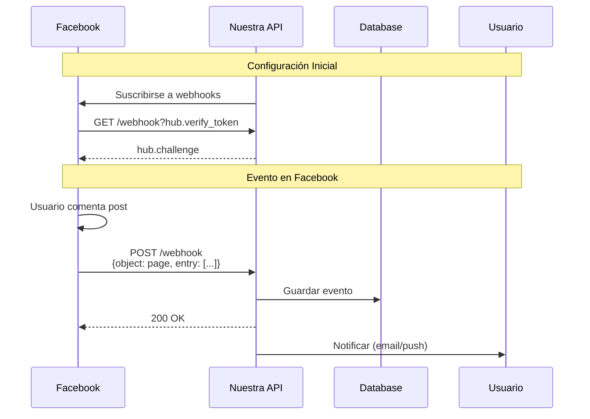

# Especificaciones Técnicas de APIs

Este documento detalla las especificaciones técnicas de integración con las APIs de redes sociales.

## Tabla de Contenidos

1. [Facebook Graph API](#facebook-graph-api)
2. [Instagram Graph API](#instagram-graph-api)
3. [Twitter API v2](#twitter-api-v2)
4. [Rate Limits y Mejores Prácticas](#rate-limits-y-mejores-prácticas)
5. [Manejo de Errores](#manejo-de-errores)

---

## Facebook Graph API

### Versión
- API Version: **v18.0**
- Documentación: https://developers.facebook.com/docs/graph-api

### Flujo OAuth 2.0



### Endpoints Utilizados

#### 1. Autorización
```http
GET https://www.facebook.com/v18.0/dialog/oauth
```

**Parámetros:**
```
client_id: {FACEBOOK_APP_ID}
redirect_uri: http://localhost:3000/callback/facebook
scope: public_profile,email,pages_show_list,pages_manage_posts,pages_read_engagement
response_type: code
state: {random_string}
```

#### 2. Intercambio de Código
```http
GET https://graph.facebook.com/v18.0/oauth/access_token
```

**Parámetros:**
```
client_id: {FACEBOOK_APP_ID}
client_secret: {FACEBOOK_APP_SECRET}
redirect_uri: {REDIRECT_URI}
code: {AUTHORIZATION_CODE}
```

**Respuesta:**
```json
{
  "access_token": "EAAxxxx...",
  "token_type": "bearer",
  "expires_in": 5183944
}
```

#### 3. Token de Larga Duración
```http
GET https://graph.facebook.com/v18.0/oauth/access_token
```

**Parámetros:**
```
grant_type: fb_exchange_token
client_id: {FACEBOOK_APP_ID}
client_secret: {FACEBOOK_APP_SECRET}
fb_exchange_token: {SHORT_LIVED_TOKEN}
```

#### 4. Información del Usuario
```http
GET https://graph.facebook.com/v18.0/me
```

**Parámetros:**
```
fields: id,name,email
access_token: {USER_ACCESS_TOKEN}
```

**Respuesta:**
```json
{
  "id": "1234567890",
  "name": "John Doe",
  "email": "john@example.com"
}
```

#### 5. Obtener Páginas del Usuario
```http
GET https://graph.facebook.com/v18.0/me/accounts
```

**Respuesta:**
```json
{
  "data": [
    {
      "access_token": "PAGE_ACCESS_TOKEN",
      "category": "Company",
      "name": "Mi Página",
      "id": "9876543210",
      "tasks": ["MANAGE", "CREATE_CONTENT"]
    }
  ]
}
```

#### 6. Publicar en Feed (Solo Texto)
```http
POST https://graph.facebook.com/v18.0/{page_id}/feed
```

**Body:**
```json
{
  "message": "Contenido de la publicación",
  "access_token": "{PAGE_ACCESS_TOKEN}"
}
```

**Respuesta:**
```json
{
  "id": "123456789_987654321"
}
```

#### 7. Publicar Foto
```http
POST https://graph.facebook.com/v18.0/{page_id}/photos
```

**Body:**
```json
{
  "url": "https://example.com/image.jpg",
  "caption": "Descripción de la imagen",
  "access_token": "{PAGE_ACCESS_TOKEN}"
}
```

### Permisos Necesarios

| Permiso | Descripción | Uso |
|---------|-------------|-----|
| `public_profile` | Perfil básico del usuario | Identificación |
| `email` | Email del usuario | Registro |
| `pages_show_list` | Listar páginas | Obtener páginas |
| `pages_read_engagement` | Leer métricas | Analytics (futuro) |
| `pages_manage_posts` | Gestionar publicaciones | Publicar contenido |

### Rate Limits

- **200 llamadas por hora por usuario**
- Los límites se aplican por app y por usuario
- Headers de respuesta:
  - `X-App-Usage`: Uso actual
  - `X-Business-Use-Case-Usage`: Uso por caso de negocio

### Códigos de Error Comunes

| Código | Mensaje | Solución |
|--------|---------|----------|
| 190 | Invalid OAuth access token | Renovar token |
| 200 | Permission denied | Solicitar permiso faltante |
| 100 | Invalid parameter | Verificar parámetros |
| 368 | Temporarily blocked | Esperar y reintentar |

---

## Instagram Graph API

### Versión
- API Version: **v18.0** (usa Facebook Graph API)
- Documentación: https://developers.facebook.com/docs/instagram-api

### Requisitos Previos

1. **Cuenta de Instagram Business**
2. **Página de Facebook vinculada**
3. **Cuenta de desarrollador de Facebook**

### Flujo de Publicación (2 Pasos)



### Endpoints Utilizados

#### 1. OAuth (Mismo que Facebook)
Instagram usa el flujo OAuth de Facebook con permisos específicos.

**Permisos adicionales:**
- `instagram_basic`
- `instagram_content_publish`

#### 2. Obtener Instagram Business Account
```http
GET https://graph.facebook.com/v18.0/{page_id}
```

**Parámetros:**
```
fields: instagram_business_account
access_token: {PAGE_ACCESS_TOKEN}
```

**Respuesta:**
```json
{
  "instagram_business_account": {
    "id": "17841400008460056"
  },
  "id": "123456789"
}
```

#### 3. Crear Contenedor de Medios
```http
POST https://graph.facebook.com/v18.0/{ig_user_id}/media
```

**Body:**
```json
{
  "image_url": "https://example.com/photo.jpg",
  "caption": "Mi publicación en Instagram #hashtag",
  "access_token": "{PAGE_ACCESS_TOKEN}"
}
```

**Respuesta:**
```json
{
  "id": "17895695668004550"
}
```

**Validaciones:**
- Imagen debe ser JPEG o PNG
- Tamaño: entre 320x320 y 1440x1440 px
- Aspect ratio: 4:5 a 1.91:1
- URL debe ser pública y accesible

#### 4. Publicar Contenedor
```http
POST https://graph.facebook.com/v18.0/{ig_user_id}/media_publish
```

**Body:**
```json
{
  "creation_id": "17895695668004550",
  "access_token": "{PAGE_ACCESS_TOKEN}"
}
```

**Respuesta:**
```json
{
  "id": "17920384757392847"
}
```

### Limitaciones

1. **Imagen obligatoria**: Instagram requiere siempre una imagen
2. **25 publicaciones por día** por cuenta
3. **No permite publicación de videos** (solo fotos)
4. **Caption máximo**: 2,200 caracteres
5. **Hashtags máximo**: 30

### Rate Limits

- **200 llamadas por hora**
- Límite de creación de contenedores: diferente del límite general
- Si se excede: Error 32 "Limit Exceeded"

---

## Twitter API v2

### Versión
- API Version: **v2**
- Documentación: https://developer.twitter.com/en/docs/twitter-api

### Flujo OAuth 2.0 con PKCE



### Endpoints Utilizados

#### 1. Autorización
```http
GET https://twitter.com/i/oauth2/authorize
```

**Parámetros:**
```
response_type: code
client_id: {TWITTER_CLIENT_ID}
redirect_uri: http://localhost:3000/callback/twitter
scope: tweet.read tweet.write users.read offline.access
state: {random_string}
code_challenge: {SHA256_HASH}
code_challenge_method: S256
```

#### 2. Intercambio de Código por Token
```http
POST https://api.twitter.com/2/oauth2/token
```

**Headers:**
```
Content-Type: application/x-www-form-urlencoded
Authorization: Basic {base64(client_id:client_secret)}
```

**Body:**
```
code={AUTHORIZATION_CODE}
grant_type=authorization_code
client_id={TWITTER_CLIENT_ID}
redirect_uri={REDIRECT_URI}
code_verifier={CODE_VERIFIER}
```

**Respuesta:**
```json
{
  "token_type": "bearer",
  "expires_in": 7200,
  "access_token": "VGNvdWYtM...",
  "scope": "tweet.read tweet.write users.read offline.access",
  "refresh_token": "bWRWa..."
}
```

#### 3. Refrescar Token
```http
POST https://api.twitter.com/2/oauth2/token
```

**Body:**
```
refresh_token={REFRESH_TOKEN}
grant_type=refresh_token
client_id={TWITTER_CLIENT_ID}
```

#### 4. Información del Usuario
```http
GET https://api.twitter.com/2/users/me
```

**Headers:**
```
Authorization: Bearer {ACCESS_TOKEN}
```

**Parámetros:**
```
user.fields: id,name,username
```

**Respuesta:**
```json
{
  "data": {
    "id": "2244994945",
    "name": "John Doe",
    "username": "johndoe"
  }
}
```

#### 5. Publicar Tweet
```http
POST https://api.twitter.com/2/tweets
```

**Headers:**
```
Authorization: Bearer {ACCESS_TOKEN}
Content-Type: application/json
```

**Body (solo texto):**
```json
{
  "text": "¡Hola Twitter! Este es mi tweet #ejemplo"
}
```

**Body (con imagen - requiere subir imagen primero):**
```json
{
  "text": "Tweet con imagen",
  "media": {
    "media_ids": ["1234567890"]
  }
}
```

**Respuesta:**
```json
{
  "data": {
    "id": "1234567890123456789",
    "text": "¡Hola Twitter! Este es mi tweet #ejemplo"
  }
}
```

#### 6. Subir Imagen (API v1.1)
```http
POST https://upload.twitter.com/1.1/media/upload.json
```

**Nota**: Subir medios usa API v1.1 con OAuth 1.0a

### Limitaciones

1. **280 caracteres máximo** por tweet
2. **Máximo 4 imágenes** por tweet
3. **300 tweets cada 3 horas**
4. Los hashtags y mentions cuentan en los 280 caracteres

### Rate Limits

| Endpoint | Límite | Ventana |
|----------|--------|---------|
| POST /tweets | 300 tweets | 3 horas |
| POST /tweets | 50 tweets | 24 horas (app) |
| GET /users/me | 75 requests | 15 minutos |
| POST /oauth2/token | 100 requests | 15 minutos |

### Scopes Necesarios

| Scope | Descripción |
|-------|-------------|
| `tweet.read` | Leer tweets |
| `tweet.write` | Crear y eliminar tweets |
| `users.read` | Leer información de usuario |
| `offline.access` | Obtener refresh token |

### Códigos de Error Comunes

| Código | Mensaje | Solución |
|--------|---------|----------|---|
| 89 | Invalid or expired token | Refrescar token |
| 186 | Tweet needs to be a bit shorter | Truncar a 280 chars |
| 187 | Status is a duplicate | No repetir tweet |
| 88 | Rate limit exceeded | Esperar reset time |

---

## Rate Limits y Mejores Prácticas

### Estrategias de Rate Limiting



### Implementación de Backoff Exponencial

```python
import time
from functools import wraps

def exponential_backoff(max_retries=3):
    def decorator(func):
        @wraps(func)
        def wrapper(*args, **kwargs):
            for attempt in range(max_retries):
                try:
                    return func(*args, **kwargs)
                except RateLimitError as e:
                    if attempt == max_retries - 1:
                        raise
                    wait_time = 2 ** attempt  # 1s, 2s, 4s
                    time.sleep(wait_time)
            return None
        return wrapper
    return decorator
```

### Tabla Comparativa de Rate Limits

| Plataforma | Límite Principal | Ventana | Renovación |
|------------|------------------|---------|------------|
| Facebook | 200 req/hora/usuario | 1 hora | Rolling |
| Instagram | 200 req/hora | 1 hora | Rolling |
| Instagram Posts | 25 posts/día | 24 horas | Fixed |
| Twitter Read | 75 req | 15 min | Fixed |
| Twitter Write | 300 tweets | 3 horas | Fixed |
| Twitter Write | 50 tweets | 24 horas | Fixed |

---

## Manejo de Errores

### Estrategia General



### Códigos de Error HTTP

| Código | Significado | Acción |
|--------|-------------|--------|
| 400 | Bad Request | Validar parámetros |
| 401 | Unauthorized | Refrescar token |
| 403 | Forbidden | Verificar permisos |
| 404 | Not Found | Recurso no existe |
| 429 | Too Many Requests | Esperar y reintentar |
| 500 | Internal Server Error | Reintentar con backoff |
| 502 | Bad Gateway | Reintentar |
| 503 | Service Unavailable | Reintentar más tarde |

### Manejo Específico por Plataforma

#### Facebook/Instagram
```python
def handle_facebook_error(error_code, error_message):
    error_handlers = {
        190: refresh_facebook_token,  # Invalid token
        200: request_missing_permission,  # Permission error
        100: validate_parameters,  # Invalid parameter
        368: wait_and_retry,  # Temporarily blocked
    }

    handler = error_handlers.get(error_code, log_unknown_error)
    return handler(error_message)
```

#### Twitter
```python
def handle_twitter_error(error_code, error_message):
    error_handlers = {
        89: refresh_twitter_token,  # Invalid/expired token
        186: truncate_tweet,  # Tweet too long
        187: skip_duplicate,  # Duplicate tweet
        88: respect_rate_limit,  # Rate limit
    }

    handler = error_handlers.get(error_code, log_unknown_error)
    return handler(error_message)
```

---

## Webhooks y Notificaciones (Futuro)

### Facebook/Instagram Webhooks



---

## Referencias

### Facebook
- [Graph API Reference](https://developers.facebook.com/docs/graph-api/reference)
- [OAuth Documentation](https://developers.facebook.com/docs/facebook-login/guides/advanced/manual-flow)
- [Rate Limiting](https://developers.facebook.com/docs/graph-api/overview/rate-limiting)

### Instagram
- [Instagram Graph API](https://developers.facebook.com/docs/instagram-api)
- [Content Publishing](https://developers.facebook.com/docs/instagram-api/guides/content-publishing)

### Twitter
- [Twitter API v2](https://developer.twitter.com/en/docs/twitter-api)
- [OAuth 2.0](https://developer.twitter.com/en/docs/authentication/oauth-2-0)
- [Rate Limits](https://developer.twitter.com/en/docs/twitter-api/rate-limits)
