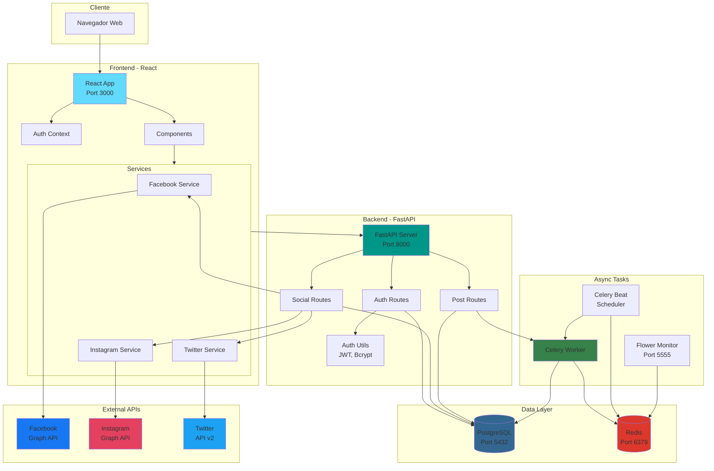
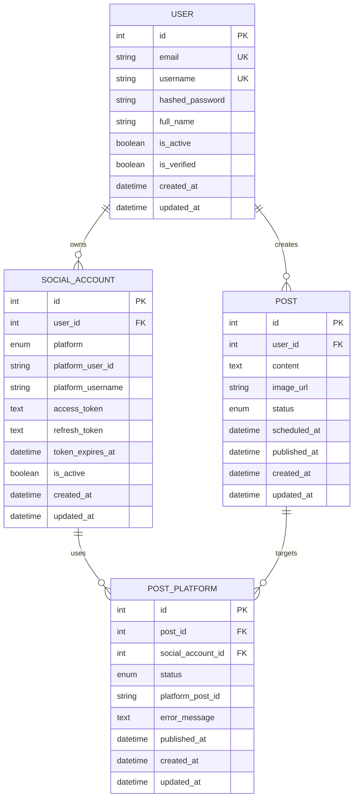
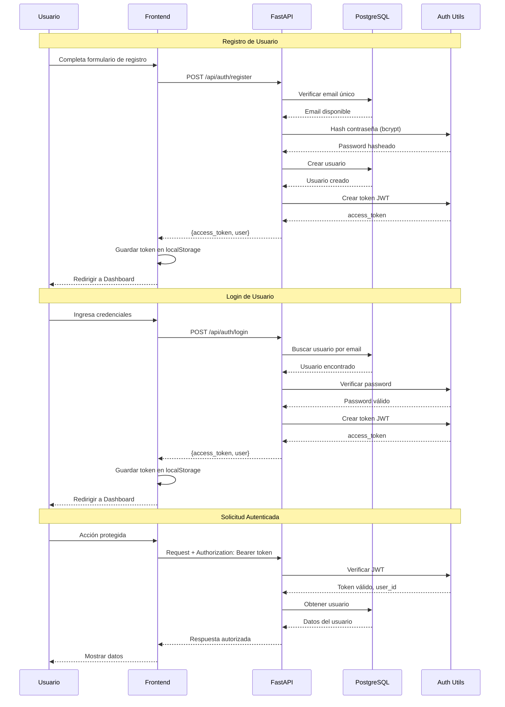
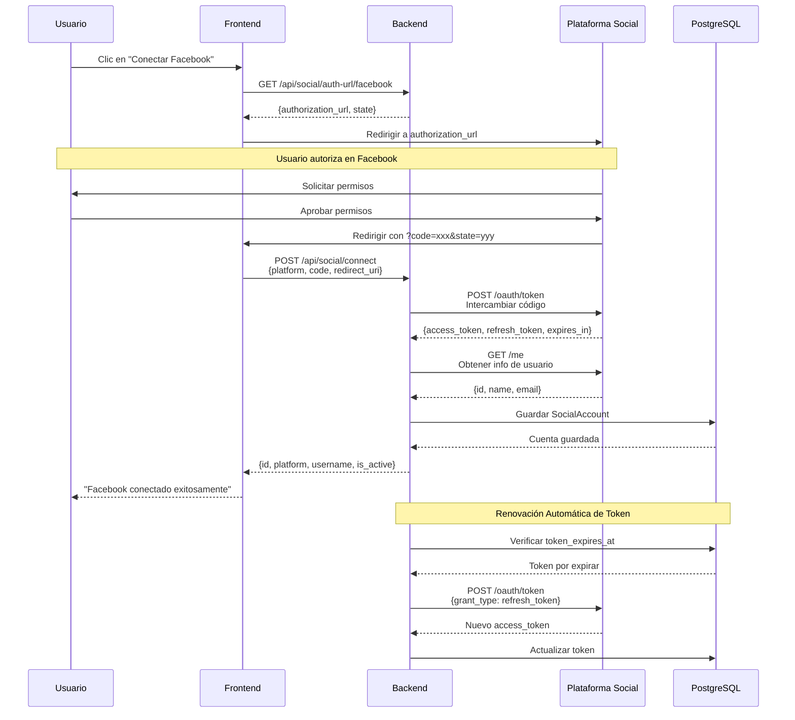
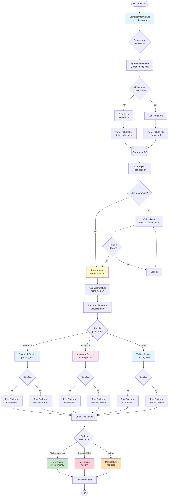
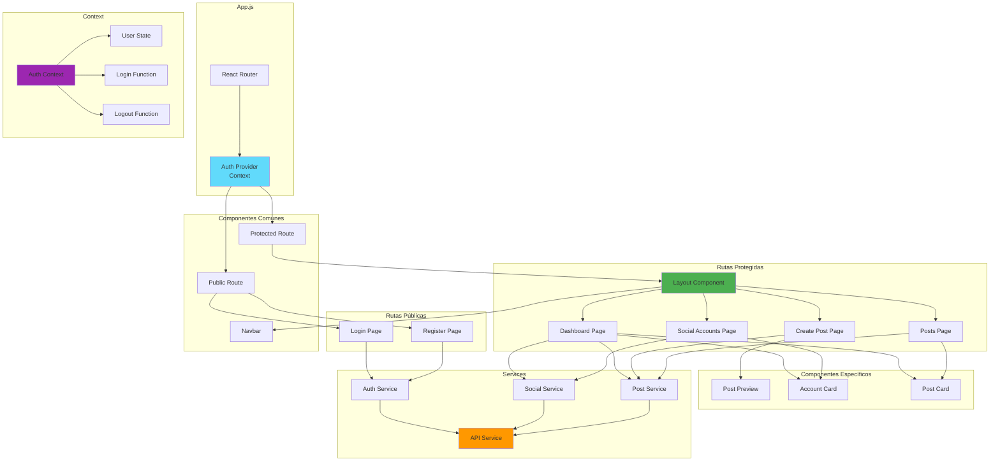
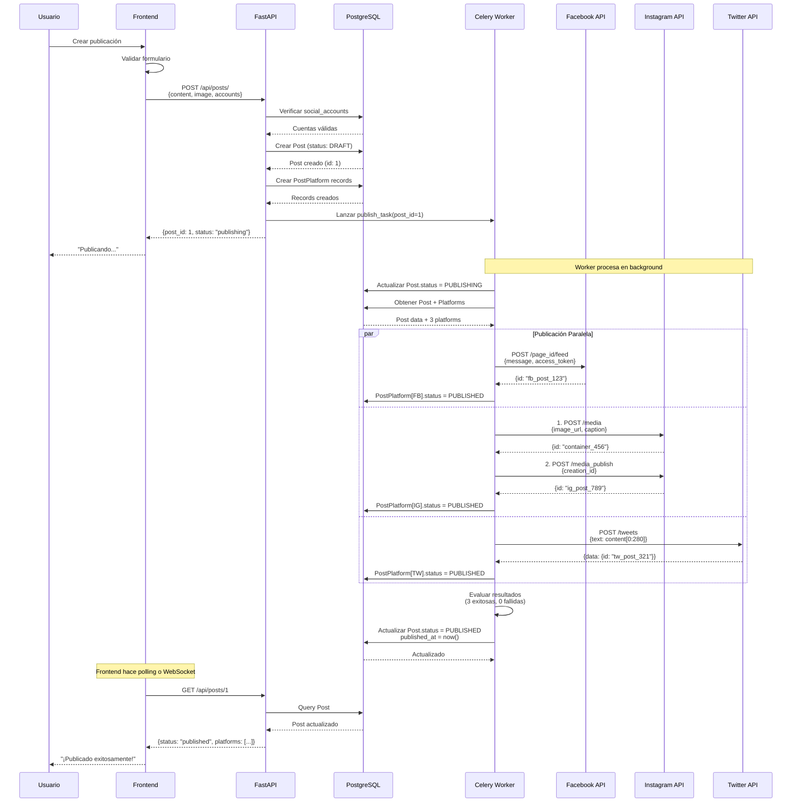
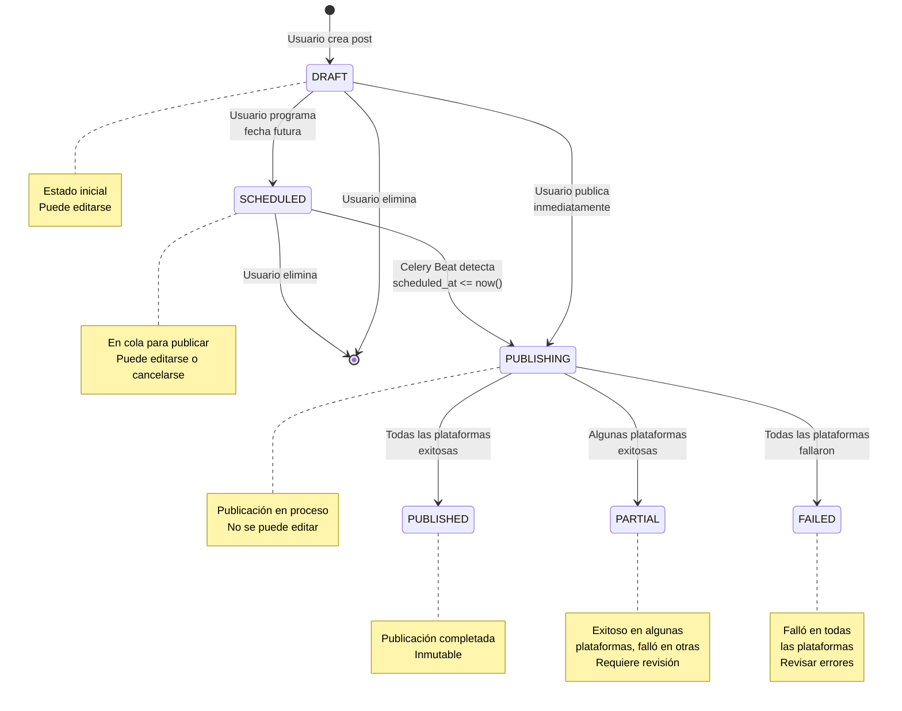
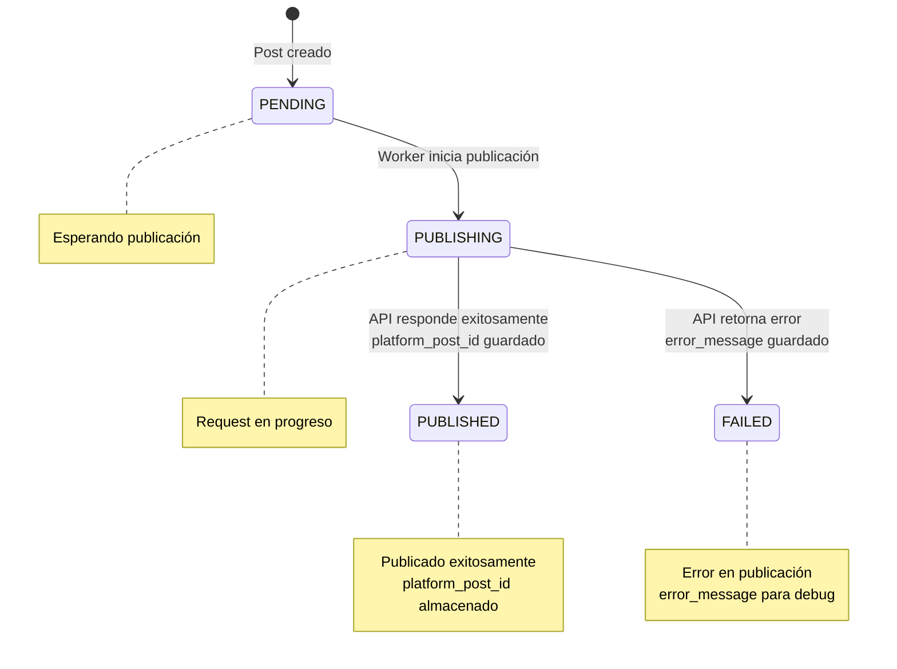
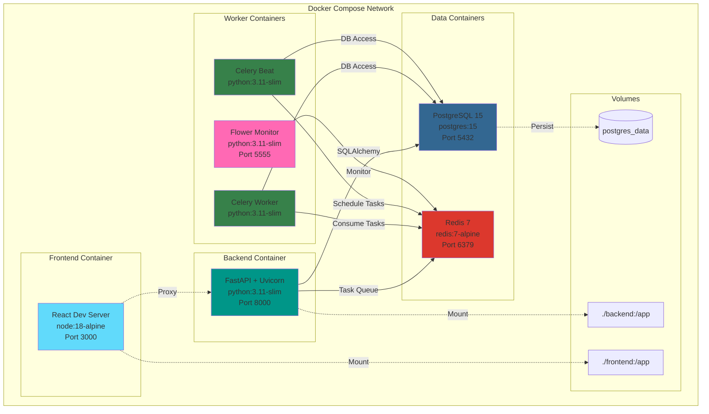

# Diagramas Técnicos - Social Media Manager

Esta documentación contiene los diagramas técnicos de la arquitectura y flujos del sistema.

## Tabla de Contenidos

1. [Arquitectura General del Sistema](#1-arquitectura-general-del-sistema)
2. [Diagrama de Base de Datos (ERD)](#2-diagrama-de-base-de-datos-erd)
3. [Flujo de Autenticación de Usuario](#3-flujo-de-autenticación-de-usuario)
4. [Flujo OAuth 2.0 para Redes Sociales](#4-flujo-oauth-20-para-redes-sociales)
5. [Flujo de Creación y Publicación](#5-flujo-de-creación-y-publicación)
6. [Arquitectura de Componentes Frontend](#6-arquitectura-de-componentes-frontend)
7. [Diagrama de Secuencia - Publicación Multi-Plataforma](#7-diagrama-de-secuencia---publicación-multi-plataforma)
8. [Diagrama de Estados de Publicación](#8-diagrama-de-estados-de-publicación)
9. [Infraestructura Docker](#9-infraestructura-docker)
10. [Flujo de Tareas de Celery](#10-flujo-de-tareas-de-celery)

---

## 1. Arquitectura General del Sistema



---

## 2. Diagrama de Base de Datos (ERD)



**Relaciones:**
- Un `USER` puede tener múltiples `SOCIAL_ACCOUNT`
- Un `USER` puede crear múltiples `POST`
- Un `POST` puede publicarse en múltiples `POST_PLATFORM`
- Un `SOCIAL_ACCOUNT` puede usarse en múltiples `POST_PLATFORM`

**Enums:**
- `platform`: facebook, instagram, twitter
- `post.status`: draft, scheduled, publishing, published, failed, partial
- `post_platform.status`: pending, publishing, published, failed

---

## 3. Flujo de Autenticación de Usuario



---

## 4. Flujo OAuth 2.0 para Redes Sociales



---

## 5. Flujo de Creación y Publicación



---

## 6. Arquitectura de Componentes Frontend



---

## 7. Diagrama de Secuencia - Publicación Multi-Plataforma



---

## 8. Diagrama de Estados de Publicación



**Estados de PostPlatform:**



---

## 9. Infraestructura Docker



**Healthchecks:**
- PostgreSQL: `pg_isready -U social_user`
- Redis: `redis-cli ping`
- Servicios dependen de healthchecks para iniciar

---

## 10. Flujo de Tareas de Celery

```mermaid
flowchart TB
    Start([Inicio]) --> BeatSchedule[Celery Beat<br/>Ejecuta cada 60s]

    BeatSchedule --> CheckTask[check_scheduled_posts]

    CheckTask --> QueryDB[Query Posts WHERE<br/>status=SCHEDULED AND<br/>scheduled_at <= now]

    QueryDB --> HasPosts{¿Encontró<br/>posts?}

    HasPosts -->|No| Wait[Esperar 60s]
    Wait --> BeatSchedule

    HasPosts -->|Sí| ForEach[Por cada post<br/>encontrado]

    ForEach --> LaunchTask[Lanzar tarea:<br/>publish_scheduled_post.delay]

    LaunchTask --> RedisQueue[(Redis Queue)]

    RedisQueue --> WorkerPick[Celery Worker<br/>toma tarea]

    WorkerPick --> UpdateStatus[Actualizar Post<br/>status = PUBLISHING]

    UpdateStatus --> GetPlatforms[Obtener plataformas<br/>del post]

    GetPlatforms --> LoopPlatforms[Iterar plataformas]

    LoopPlatforms --> CheckPlatform{Tipo de<br/>plataforma?}

    CheckPlatform -->|Facebook| FacebookFlow[FacebookService<br/>1. get_user_pages<br/>2. publish_post]

    CheckPlatform -->|Instagram| InstagramFlow[InstagramService<br/>1. get_pages<br/>2. get_ig_account<br/>3. create_container<br/>4. publish_container]

    CheckPlatform -->|Twitter| TwitterFlow[TwitterService<br/>1. publish_tweet<br/>truncate a 280 chars]

    FacebookFlow --> TryCatch1{¿Exitoso?}
    InstagramFlow --> TryCatch2{¿Exitoso?}
    TwitterFlow --> TryCatch3{¿Exitoso?}

    TryCatch1 -->|Sí| SaveSuccess1[PostPlatform<br/>status=PUBLISHED<br/>platform_post_id]
    TryCatch1 -->|No| SaveError1[PostPlatform<br/>status=FAILED<br/>error_message]

    TryCatch2 -->|Sí| SaveSuccess2[PostPlatform<br/>status=PUBLISHED<br/>platform_post_id]
    TryCatch2 -->|No| SaveError2[PostPlatform<br/>status=FAILED<br/>error_message]

    TryCatch3 -->|Sí| SaveSuccess3[PostPlatform<br/>status=PUBLISHED<br/>platform_post_id]
    TryCatch3 -->|No| SaveError3[PostPlatform<br/>status=FAILED<br/>error_message]

    SaveSuccess1 --> CounterIncr[success_count++]
    SaveSuccess2 --> CounterIncr
    SaveSuccess3 --> CounterIncr

    SaveError1 --> CounterFail[failure_count++]
    SaveError2 --> CounterFail
    SaveError3 --> CounterFail

    CounterIncr --> AllDone{¿Todas<br/>procesadas?}
    CounterFail --> AllDone

    AllDone -->|No| LoopPlatforms

    AllDone -->|Sí| EvaluateResults{Evaluar<br/>resultados}

    EvaluateResults -->|success>0 AND failure=0| SetPublished[Post.status<br/>= PUBLISHED]
    EvaluateResults -->|success>0 AND failure>0| SetPartial[Post.status<br/>= PARTIAL]
    EvaluateResults -->|success=0 AND failure>0| SetFailed[Post.status<br/>= FAILED]

    SetPublished --> SetTimestamp[Post.published_at<br/>= now]
    SetPartial --> SetTimestamp
    SetFailed --> SetTimestamp

    SetTimestamp --> CommitDB[(Commit a DB)]

    CommitDB --> ReturnResult[Retornar resultado<br/>{post_id, status,<br/>success_count,<br/>failure_count}]

    ReturnResult --> End([Fin])

    style BeatSchedule fill:#fff9c4
    style WorkerPick fill:#c8e6c9
    style FacebookFlow fill:#e3f2fd
    style InstagramFlow fill:#fce4ec
    style TwitterFlow fill:#e1f5fe
    style SetPublished fill:#a5d6a7
    style SetPartial fill:#ffcc80
    style SetFailed fill:#ef9a9a
```

---

## Convenciones de Diagramas

### Colores

- **Azul claro** (#61dafb): Frontend/React
- **Verde** (#009688): Backend/FastAPI
- **Verde oscuro** (#37814a): Celery/Workers
- **Azul oscuro** (#336791): PostgreSQL
- **Rojo** (#dc382d): Redis
- **Azul Facebook** (#1877f2): Facebook API
- **Rosa Instagram** (#e4405f): Instagram API
- **Azul Twitter** (#1da1f2): Twitter API

### Símbolos

- `[]` Proceso/Componente
- `{}` Decisión
- `()` Inicio/Fin
- `[()]` Base de datos
- `-->` Flujo síncrono
- `-.->` Flujo asíncrono o dependencia

---

## Exportar Diagramas

### Como PNG (GitHub/GitLab)

Los diagramas Mermaid se renderizan automáticamente en:
- GitHub
- GitLab
- VS Code (con extensión)
- Confluence
- Notion

### Como SVG/PNG

Usar herramientas online:
- https://mermaid.live/
- https://mermaid.ink/

### En Documentación

Estos diagramas están en formato Mermaid y son compatibles con:
- MkDocs (plugin mermaid2)
- Docusaurus
- Sphinx (con extensión)
- Hugo

---

## Referencias

- [Mermaid Documentation](https://mermaid.js.org/)
- [Mermaid Live Editor](https://mermaid.live/)
- [GitHub Mermaid Support](https://github.blog/2022-02-14-include-diagrams-markdown-files-mermaid/)
